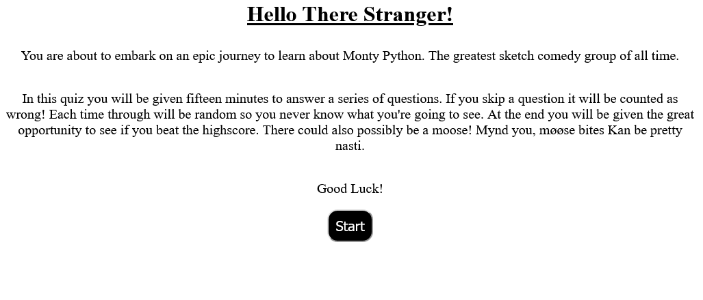

# The Greatest Quiz on Earth

## Description

This is a quiz that is designed to test your knowledge of various Monty Python sketches. You can use this [link](https://tutor78.github.io/monty-python-quiz) to access the quiz itself.

## Use

* When starting from the landing page you click the start button
* A series of non repeating random questions will appear
* If you choose an option it will check to see if that matches the answer or not
* If you do not choose an option it is automatically counted as wrong
* At the end you will be presented with a simple score screen showing your score and the current high score
* If your score is the new highscore you will be prompted to enter a name that will be put into localStorage
* Then if you choose to play again you will once again be presented with the landing page

## Preview

## Languages

- HTML
- CSS
- Javascript

## License

This project is licensed under [GNU GPLv3](LICENSE).

## Contributions

The persistant timer was built using a [stackoverflow solution](https://stackoverflow.com/questions/63516541/countdown-timer-make-it-persistent-even-after-refresh-or-reload) by Udith Gunuratna.